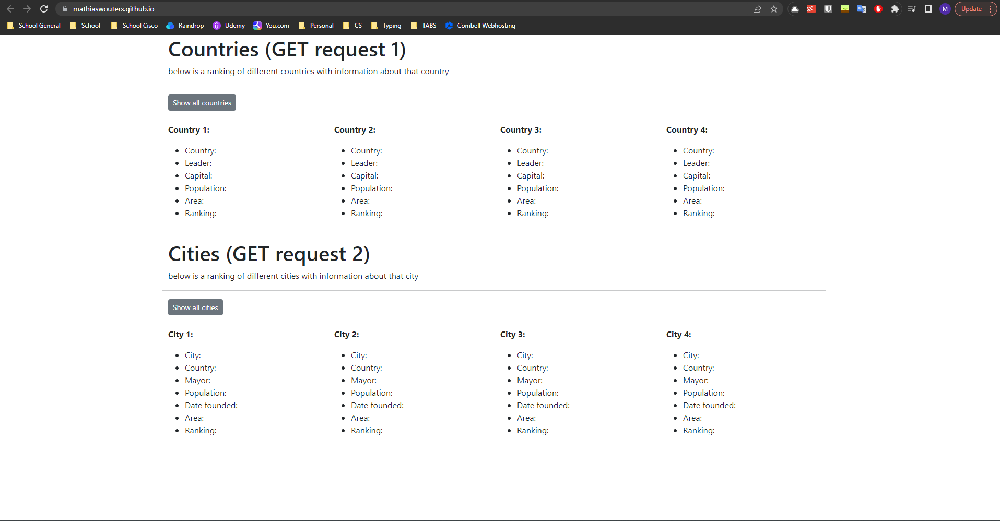
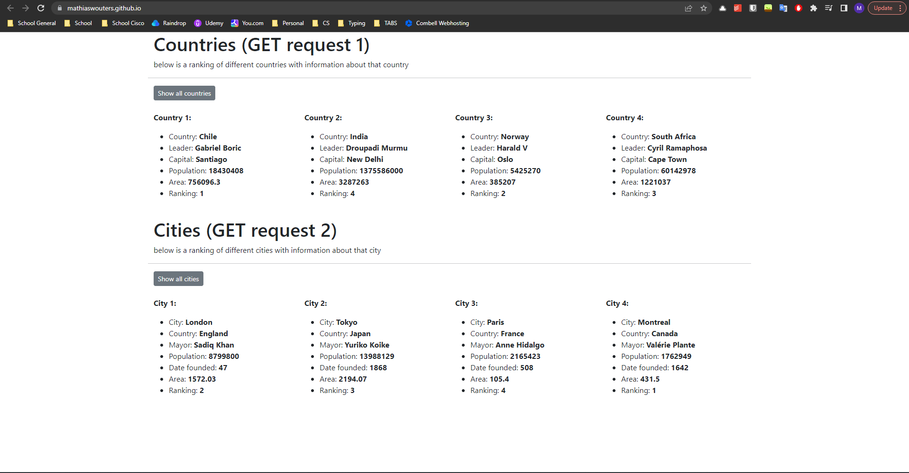
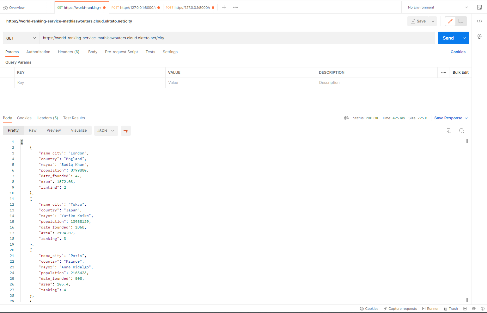
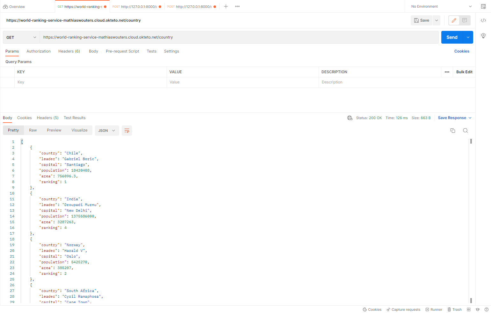
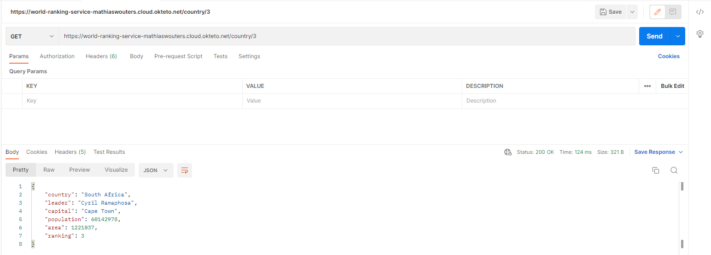
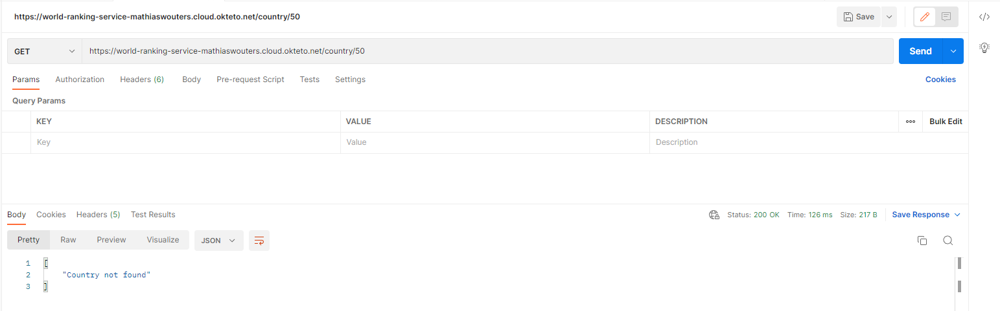
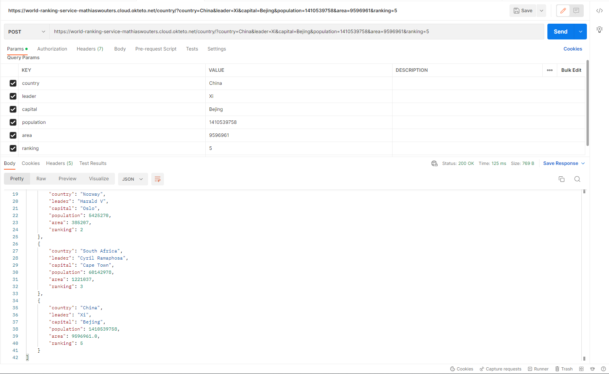
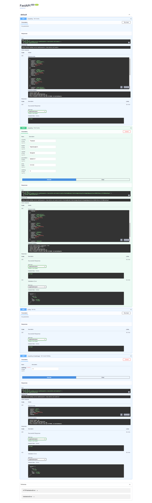

# Basisproject - API Development

Voor dit project moesten een API maken rond en zelf te kiezen thema. Deze API moest via docker gehost worden en er moest ook een front-end aangekoppeld zijn.

# Thema

Ik heb gekozen voor het thema reizen omdat ik zelf heel graag reis en hier kon ik al een begin maken voor een mogelijk programma dat mijn ranglijst van mijn top landen en steden kon bijhouden. Ik heb het zo gemaakt dat je op de front end 2 deeltjes ziet, één voor de landen en één voor de steden. Bij de 2 categoriën staat ook een knop om de landen/steden die dan al in de database staan te laten zien. Ik geef dan ook meteen wat informatie mee over die bestemming en er staat ook de rang bij.

De landen/steden staan opgeslagen in de API zelf in een JSON structuur.

# API

In de API maak ik gebruik van 3 GET requests die dat elk een andere functie heeft:

- GET request 1: deze laat al de steden zien die dat in de database zitten
- GET request 2: deze laat al de landen zien die dat in de database zitten
- GET request 3: hierbij geef je een rank mee en dan laat de api het land zien die op die rank staat

Ik maak ook gebruik van een POST request in mijn API, hierbij voeg ik een nieuw land toe + al de gegevens over dat land aan de database.

# Front-end

In mijn front-end roep ik de 2 get functies op die dat dan de landen/steden in mijn database laten zien. Ik heb de front-end wat bewerkt met bootstrap zodat deze niet de lelijke default html style heeft.

# Postman screenshots

## GET request 1

## GET request 2

## GET request 3

## GET request 3 error

## POST request 1

# OpenAPI docs screenshots

# Links

Hosted API: https://world-ranking-service-mathiaswouters.cloud.okteto.net
Front-end repo: https://github.com/mathiaswouters/mathiaswouters.github.io
Hosted front-end: https://mathiaswouters.github.io/
